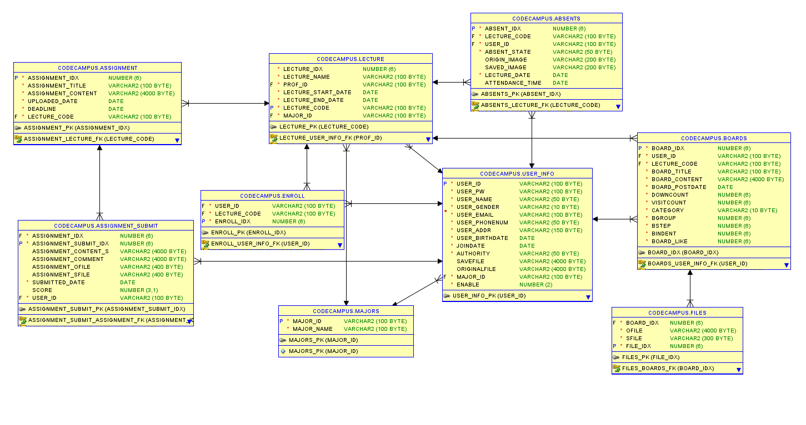
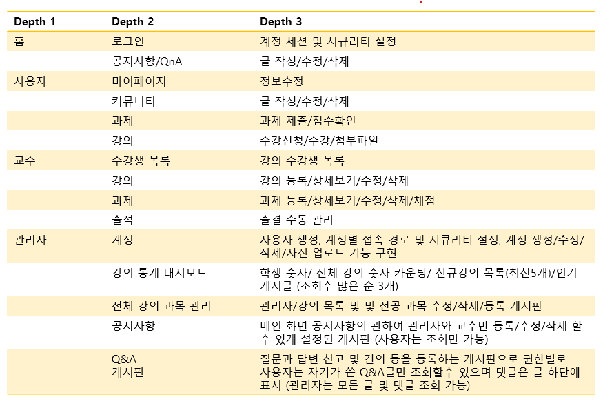

# 🎓 Code Campus LMS

**Code Campus**는 강의를 수강할 수 있는 온라인 학습 관리 시스템(LMS)입니다.  
Spring Security를 기반으로 **교수, 학생, 관리자** 권한을 분리하여 각 사용자 유형에 맞는 기능을 제공합니다.  

---

## 👨‍👩‍👧‍👦 팀 구성 및 담당 기능 영상

- **안현준** - [학생 기능 영상 보기](https://youtu.be/lELCxNth6Yc)
- **배혜진**
- **박선민**
---

## 📅 개발 기간  
🛠️ 2025.06.26 ~ 2025.07.17

---

## ⚙️ 기술 스택

           

---

## 🗂️ 프로젝트 설명

### 📌 역할별 프로세스

#### 👨‍🎓 학생(Student) - 안현준
- 수강신청 (강의명/교수명 검색 가능, Enroll 테이블에 저장, 페이징)
- 내 강의 목록 확인 및 이동
- 강의 수강 (영상/파일 첨부자료 구분 출력)
- 과제 확인, 제출 및 수정 (마감일 이전까지만 가능, 페이징)
- 마이페이지 (프로필 이미지, 비밀번호 변경)
- 커뮤니티 (게시글 등록/수정/삭제, 파일 업로드, 답글, 검색, 페이징)

#### 👩‍🏫 교수(Professor) - 배혜진
- 강의 업로드 (카테고리 분류: Q=QnA, L=강의, C=커뮤니티, N=공지사항)
- 다중 첨부파일 업로드 (mp4, mov, png, jpg 등)
- 과제 등록 (제목/마감일/내용 유효성 검사 포함)
- 과제 채점 및 제출 과제 확인
- 출석 관리 (수동 출결 입력 가능)
- 수강생 목록 조회 (페이징, 검색 가능)
- 강의 목록 검색 (필터 기능)

#### 🛠 관리자(Admin) - 박선민
- 대시보드: 학생 수, 강의 수, 신규 강의, 인기 게시글(조회수 Top 3)
- 회원 관리: 등록/수정/삭제, 활성/비활성 설정, 비밀번호 초기화(생년월일)
- 회원 정보 수정: 프로필 이미지 업로드/변경 가능
- 강의 관리: 전체 강의 목록 조회/수정/삭제
- 공지사항 관리: 등록/수정/삭제
- Q&A 관리: Q 카테고리 글 조회/수정/삭제, 답글 권한 분리

---

## 📂 프로젝트 구성

전체 ERD 보기

전체 프로젝트 구성도 보기

---

## 🎬 실행 화면

실행 화면 보기

### 로그인

### 수강 신청

### 강의 목록

### 강의 첨부파일 구분

### 과제 목록

### 과제 작성

### 게시글 작성

### 게시글 수정 및 멀티파일

### 프로필 이미지 변경

